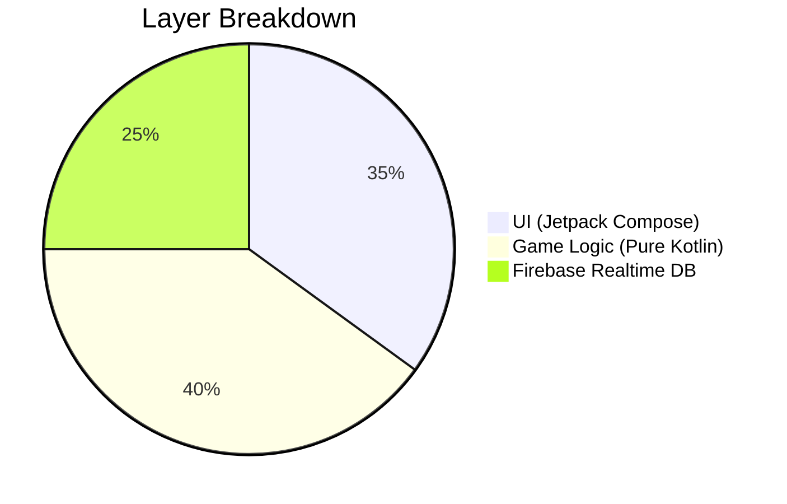
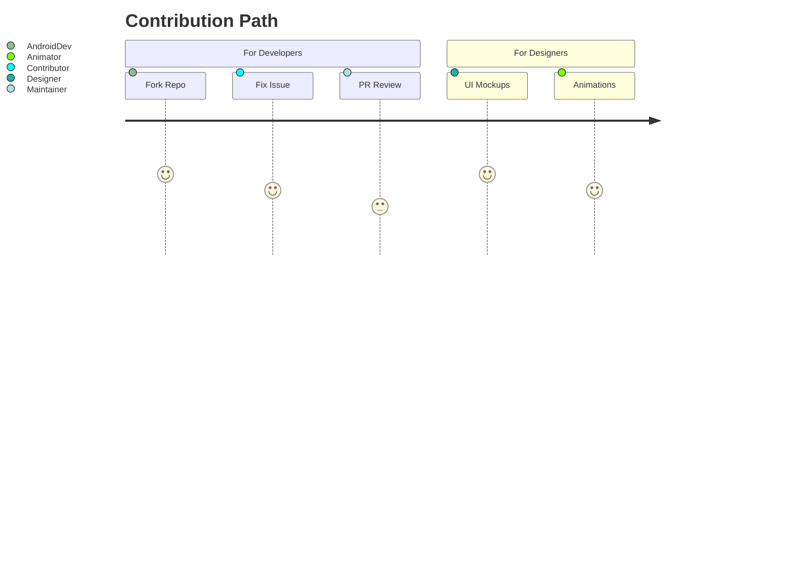
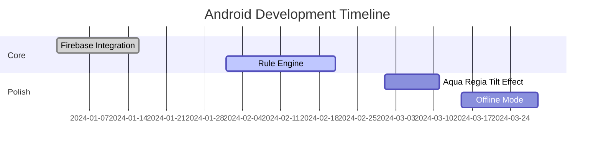

# 👑♦️ King of Diamonds - Android Edition

*"Survival by numbers... or dissolve in digital Aqua Regia."*  
[](https://kotlinlang.org)
[](https://developer.android.com)
[](https://firebase.google.com)
[](https://github.com/yourusername/king-of-diamonds/wiki/Multiplayer-Guide)


<p align="center">
  
</p>

---

## 📜 Table of Contents
- [🚀 Setup](#-setup)
- [🎯 Game Rules](#-game-rules)
- [🏗️ Architecture](#️-architecture)
- [🤝 Contribute](#-contribute)
- [🧪 Roadmap](#-roadmap)
- [📜 License](#-license)

---

## 🚀 Setup

### Prerequisites
- Android Studio Flamingo+
- Firebase Project (for real-time multiplayer)
- Kotlin 1.9+

### Installation
```bash
git clone https://github.com/yourusername/king-of-diamonds-android.git
cd king-of-diamonds-android

# Add your firebase config to:
# app/src/main/res/values/secrets.xml
```

---

## 🎯 Game Rules

### ⚖️ Dynamic Penalty System
| Players | Rule                              | Code Reference         |
|---------|-----------------------------------|------------------------|
| 5–4     | Base logic (`GameLogic.kt`)       | `calculateRound()`     |
| 4       | Duplicate check (`AntiCheat.kt`)  | `validateNumbers()`    |
| 3       | Double penalty (`PenaltySystem.kt`)| `applySpecialPenalty()`|
| 2       | 0-vs-100 showdown (`DuelMode.kt`) | `resolveDuel()`        |

**Code Snippet (Rule Engine):**
```kotlin
fun calculateTarget(numbers: List<Int>): Double {
    val validNumbers = if (playerCount == 4) filterDuplicates(numbers) else numbers
    return validNumbers.average() * 0.8
}
```

---

## 🏗️ Architecture

### Tech Stack


### Key Components
| Module          | Purpose                                | Symbolic Icon |
|-----------------|----------------------------------------|---------------|
| `AquaRegiaAnimator` | Tilt animation for elimination       | ⚗️            |
| `NumberValidator`   | Detect duplicate/illegal inputs      | 🔍            |
| `LiveMatchmaker`    | Firebase-powered multiplayer queues  | 🌐            |

---

## 🤝 Contribute

### Contribution Map


### How to Help:
1. **Report Bugs**: File issues with 🐞 emoji + detailed logs  
2. **Improve UI**: Enhance Jetpack Compose screens in `ui/`  
3. **Optimize Sync**: Tackle `FirebaseHelper.kt` latency issues  

**Style Guide**:  
- Use `ViewModel` for game state  
- Prefer `Sealed Classes` for game events  
- Max 2 `Modifier` chains in Compose  

---

## 🧪 Roadmap

### Priority Tasks


---

## 📜 License
MIT License - See [LICENSE](LICENSE).  
*"Modify freely, but credit the alchemists!"* 🔥

---

<p align="center">
  <sub>Built with ❤️ and <code>viewModelScope</code> by Soham</sub>
</p>
